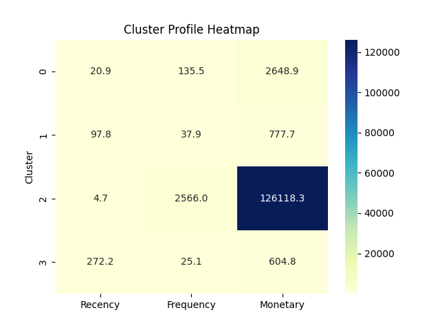

# 🧠 Customer Segmentation with Clustering (RFM Analysis)

## 📌 Objective
Segment customers based on their purchasing behavior using **RFM analysis** and **Clustering Algorithms** to help businesses personalize marketing strategies.

---

## 📁 Dataset
- **Expected Format**: Online Retail dataset (CSV) with columns like `CustomerID`, `InvoiceDate`, `Quantity`, `UnitPrice`, etc.
- ✅ **No dataset stored in repo** — use the **file upload** feature in the app!

---

## 🧹 Workflow

### 1. Data Preprocessing (`preprocess.py`)
- Removed missing CustomerIDs
- Removed cancelled orders
- Filtered out non-positive `Quantity` or `UnitPrice`
- Created `TotalPrice = Quantity × UnitPrice`

### 2. RFM Feature Engineering (`rfm.py`)
- **Recency**: Days since last transaction
- **Frequency**: Number of unique purchases
- **Monetary**: Total money spent

### 3. Clustering Algorithms (`clustering.py`)
- ✅ KMeans
- ✅ DBSCAN (with noise detection)
- ✅ Agglomerative Clustering

### 4. Visualization (`visualize.py`)
- Interactive PCA cluster plot
- Log-scaled heatmap of average RFM values

### 5. Streamlit App (`app.py`)
- Upload your dataset using the sidebar
- Select clustering algorithm and parameters
- View cluster insights and download results

---

## 🚀 Live App

🔗 **[Try the Live App on Streamlit Cloud](https://customer-segmentation-dashboard.streamlit.app)**  
_(Upload your CSV file to begin)_

---

## ▶️ How to Run Locally

```bash
# 1. Install dependencies
pip install -r requirements.txt

# 2. Launch Streamlit dashboard
streamlit run app.py
```

---

## ☁️ Deploy to Streamlit Cloud

1. Push this project to a public GitHub repo (no dataset needed)
2. Go to [Streamlit Cloud](https://streamlit.io/cloud)
3. Click **"New App"** → Select your repo and `app.py`
4. App will prompt user to **upload CSV** on launch
5. Click **Deploy**

---

## 📈 Sample Outputs

### PCA Cluster Projection
.png)

### Log-Scaled Heatmap


---

## 👨‍💻 Author
Alp Yaman
